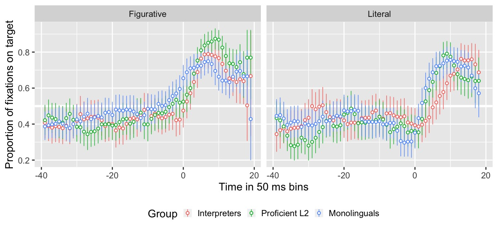
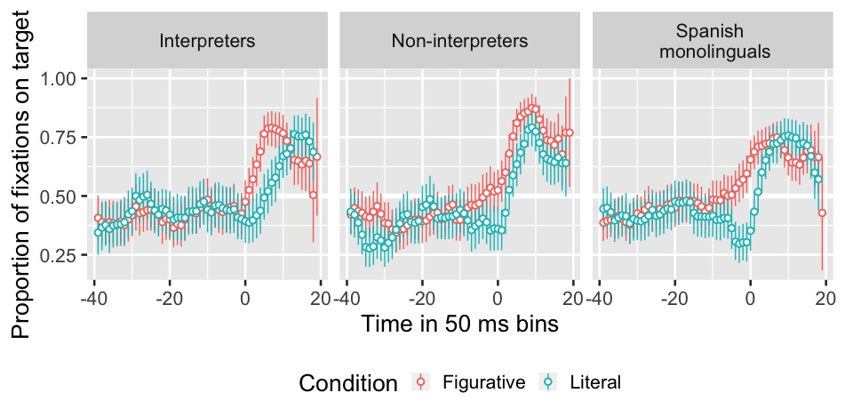
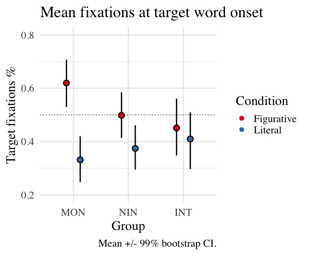

# Introduction
  
 

 
  
### .center[To be left high and dry]   
  
### .center[The grass is always greener on the other side]

???

Pollio et al.'s (1987)
English sources 3k novel metaphors + 7k idioms/week

coll_pub

---

# Introduction

 

Even proficient L2 speakers have problems (Hill, 1999; Littlemore et al., 2011)   
  
- Inefficient processing (Kim & Nam, 2017)   
  
- Use of different processing strategies (Littlemore & Low, 2006) 
  
--

- Timeline processing   

--

 
 
 

### How do we process information?

---

# Introduction

### Constraint-Based Model (Libben & Titone, 2008)

- L1
- End anticipation

 

### Literal Saliency Hypothesis (Cieślicka, 2006)

- L2
- Literal meaning prevalent

---

# Introduction

### Semantic Anticipation
  
- Gender (Huettig & Janse, 2016)   
    
- Tense (Altmann & Kamide, 2007)   
    
- Stereotypical constraints (Kamide, Altmann & Haywood, 2003)   
    
- Nouns based on frequent context (DeLong, Urbach and Kutas, 2005; Nieuwland et al., 2017)

---

# Introduction

### Interpreters
  
- Require anticipation skills (Bajo, Padilla, & Padilla, 2000)   

- Increased reading comprehension over non-interpreters (Bajo, Padilla & Padilla, 2000)  

- Increased cortical thickness in brain areas related to language over non-interpreters (e.g., phonetic processing and higher-level formulation of propositional speech, Hervais-Adelman, Moser-Mercer, Murray, & Golestani, 2017).  

- Detect linguistic errors in written contexts better than monolinguals (Yudes, Macizo, Morales, & Bajo, 2013)

???

Figurative lang is complex, so more cognitive resources might be needed.
Interpreters have proved to be better at processing languages (see slide), so their skills might serve them well in processing fig expressions too.

---

# The study

### Can L1 and advanced L2 speakers of Spanish (interpreters and non-interpreters) predict collocations based on the first lexical items of the expressions?

???
What expressions type of figurative collocations should we research deeper?

What populations to study?

--

 
.center[
Por _nada_ del __mundo__      
 (For (anything in) the world) 

]

---

# The study

## Hypotheses

### L1 speakers & Interpreters 

 Anticipate figurative expressions but not literal based on the first lexical element. 

### L2 speakers 

 Cannot anticipate anything. 

---

# Methods

## Participants
  
- 32 L1 Spanish   

- 26 L1 English, advanced L2 Spanish non-interpreters   

- 24 L1 English, L2 Spanish interpreters

???

Screening test: DELE
Homogeneized: WM -> Comparable in working memory and phonological short-term memory.

---

# Methods

## Materials

8 collocations with English equivalent    
8 collocations without English equivalent
(+ literal versions)    

Frequency: CREA
 

### Example           

| Figurative | Literal |
|:---|:---|  
|  |   |    
| por nada del mundo  | por nada del plato |           
| (For the world) | (For anything on the plate) |

---

# Methods

## Procedure  

.pull-left[### Norming Phase 
- Expression knowledge
- Familiarity      
(Molinaro & Carreiras, 2010; Cacciari & Corradini, 2015)]

--

.pull-right[### Experimental Phase

- DELE proficiency test
- Sociolinguistic background
- Eye-tracking visual world paradigm
- Letter-number sequencing working memory test (WAIS, Wechsler, 1997)  
- Collocation recognition task (2nd norming phase)]

???

Min 40/56 DELE
Wechsler Adult Intelligence Scale Test

---

# Methods

### Eye-tracking sample trial

.center[

]

.left-column[

.right[

 
<audio controls style="width: 120px;">
  <source src="./libs/F01_C1.ogg" type="audio/ogg">
  <source src="./libs/F01_C1.wav" type="audio/mpeg">
</audio>]

]

.right-column[ 

.left[

_La niña no se come por nada del mundo la colifor._]

(The little girl will not eat for anything in the world the cauliflower)

]

???

200 ms shift

<audio controls>
  <source src="./libs/FO1_C1.wav" type="audio/wav">
  <embed src="./libs/FO1_C1.wav" autostart="false" hidden="true" />
</audio>

---

# Results

## Expressions

8 figurative collocations with English equivalent   
1 fgurative collocations without English equivalent

---

# Results

### Timecourse for gaze fixation pattern according to condition

La niña no se come por nada del .RUred[m]undo la coliflor.

???

t-test marginally significant for monolinguals

---

# Results

### Timecourse for gaze fixation pattern according to group

La niña no se come por nada del .RUred[m]undo la coliflor.

---

# Results

### GLMM

## Fixed effects:

Main effect: Condition (figurative vs. literal)

## Random effects:

Interaction of condition and frequency on slope

???

Random effects variety within participant

---

# Results

### GLMM Confience Interval Plot

---

# Discussion

- Are expressions with equivalents easier to learn or are L2 speakers transfering semantic knowledge?

- There was no difference hinted at in performance between interpreters and non-interpreters L2ers.

- Only monolinguals might anticipate (Constraint-Based Model)

- The three groups fixated more on the correct target words in figurative trials than literal trials. (vs Literal Saliency Hypothesis)

---

# Current direction

- Larger pool of expressions + other factors involved: Cross-linguistic effects   

- Turning point between monolingual and late L2 speakers? -> Heritage speakers    

---

# Conclusion

 

We process infomation differently in L1 and other languages.    

 

 Either 

- Chunk (beginners) > More analytic (L2 proficient)

 Or 

- More alternatives considered. 

---
class: title-slide-section-grey

 
 
 
 
 
 

.center[
# Thank you   
]

