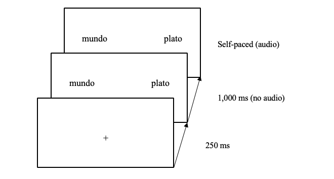

# Introduction

### .center[To be left high and dry   
The grass is always greener on the other side]

--

Even proficient L2 speakers have problems (Hill, 1999; Littlemore et al., 2011)   
- Inefficient processing (Kim & Nam, 2017)
- Use of different processing strategies (Littlemore & Low, 2006) 
--

- Timeline processing + other alternatives?

???

Pollio et al.'s (1987)
English sources 3k novel metaphors + 7k idioms/week

coll_pub

---

# Introduction

### Constraint-Based Model (Libben & Titone, 2008)

  End anticipation

### Literal Saliency Hypothesis (Cieślicka, 2006)

  Literal meaning preferred

---

# Introduction

### Semantic Anticipation

- Gender (Huettig & Janse, 2016)
- Tense (Altmann & Kamide, 2007)
- Stereotypical constraints (Kamide, Altmann & Haywood, 2003)
- Nouns based on frequent context (DeLong, Urbach and Kutas, 2005; Nieuwland et al., 2017)

---

# Introduction

### Interpreters

- Require anticipation skills (Bajo, Padilla, & Padilla, 2000)
- Increased reading comprehension over non-interpreters (Bajo, Padilla & Padilla, 2000)
- Increased cortical thickness in brain areas related to language over non-interpreters(e.g., phonetic processing and higher-level formulation of propositional speech, Hervais-Adelman, Moser-Mercer, Murray, & Golestani, 2017).
- Detect linguistic errors in written contexts better than monolinguals (Yudes, Macizo, Morales, & Bajo, 2013)

???

Figurative lang is complex, so more cognitive resources might be needed.
Interpreters have proved to be better at processing languages (see slide), so their skills might serve them well in processing fig expressions too.

---

# The study

### Can L1 and advanced L2 speakers of Spanish (interpreters and non-interpreters) predict collocations (with and without EN equivalents) based on the first lexical items of the expressions?

???
What expressions type of figurative collocations should we research deeper?

What populations to study?

--

 
.center[
Por _nada_ del __mundo__      
 (For (anything in) the world) 

]

---

# The study

## Hypotheses

### L1 speakers & Interpreters 

Anticipate figurative expressions but not literal based on the first lexical element. 

### L2 speakers 

Cannot anticipate anything.         

---

# Methods

## Participants

- 32 L1 Spanish
- 26 L1 English, advanced L2 Spanish non-interpreters
- 24 L1 English, L2 Spanish interpreters
      
      
      

???

Screening test: DELE
Homogeneized: WM -> Comparable in working memory and phonological short-term memory.

---

# Methods

## Materials

8 collocations with English equivalent    
8 collocations without English equivalent
(+ literal versions)    

Frequency: CREA
 
 

### Example           

| Figurative | Literal |
|:---|:---|  
|  |   |    
| por nada del mundo  | por nada del plato |           
| (For the world) | (For anything on the plate) |

---

# Methods

## Procedure

### Norming Phase 
- Expression knowledge
- Familiarity      
(Molinaro & Carreiras, 2010; Cacciari & Corradini, 2015)

--

### Experimental Phase

- DELE
- Sociolinguistic background
- Eye-tracking visual world paradigm
- Verbal working memory task
- Collocation recognition task (2nd norming phase)

???

Min 40/56 DELE
Wechsler Adult Intelligence Scale Test (Wechsler, 1997)

---

# Methods

### Eye-tracking sample trial

Audio: _La niña no se come por nada del mundo la colifor._   
(The little girl will not eat for anything in the world the cauliflower)

???

200 ms shift

<audio controls>
  <source src="./libs/FO1_C1.wav" type="audio/wav">
  <embed src="./libs/FO1_C1.wav" autostart="false" hidden="true" />
</audio>

---

# Statistical Analysis

### T-tests
### Generalized Linear Mixed Model

--

.pull-left[
FIXED EFFECTS
- Group
- Condition
- Frequency of occurrence   

RANDOM EFFECTS
- Participant
- Item
]

.pull-right[
DEPENDENT VARIABLE
- Count and proportion of fixations on target
]

---

# Results

## Expressions

8 figurative collocations with English equivalent   
1 fgurative collocations without English equivalent

---

# Results

## Anticipation By figurativeness

???

50 ms bins

---

# Results

## Anticipation By group

---

# Results

### GLMM

## Fixed effects:

Main effect: Condition (figurative vs. literal)

## Random effects:

Interaction of condition and frequency on slope
---

# Results

### GLMM Plot

---

# Discussion

- Are expressions with equivalents easier to learn or are L2 speakers transfering semantic knowledge?

- Only monolinguals might anticipate.

- The three groups fixated more on the correct target words in figurative trials than literal trials.

- There was no difference hinted at in performance between interpreters and non-interpreters L2ers.

---

# Current direction

- Larger pool of expressions + other factors involved: Cross-linguistic effects

- Turning point between L1 and L2 speakers? -> Heritage speakers

---
class: title-slide-section-grey

 
 
 
 
 
 

.center[
# Thank you   

???.RUred[you]
]

