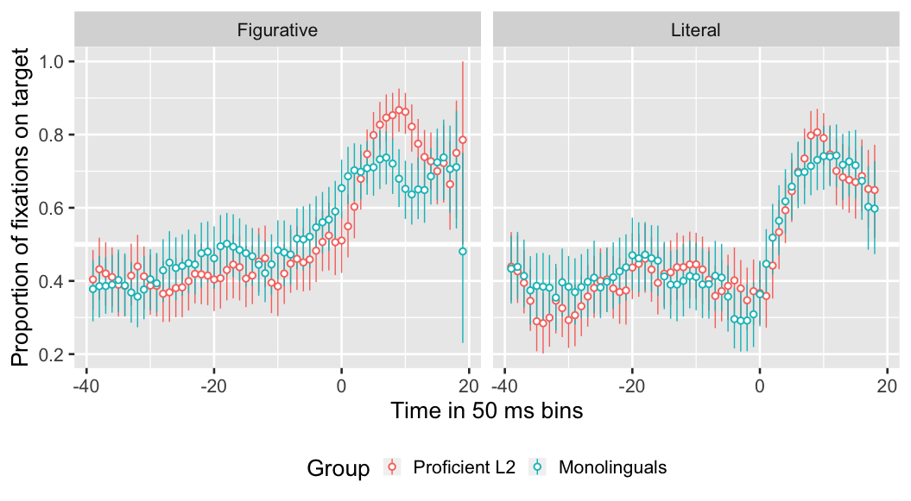
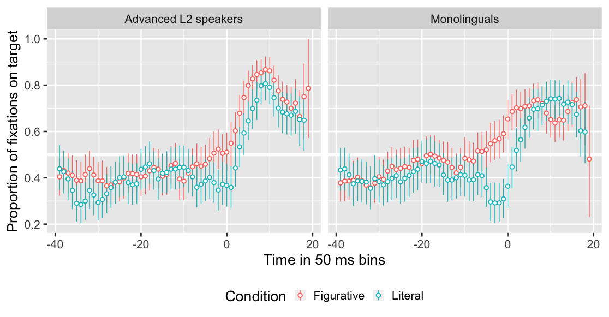
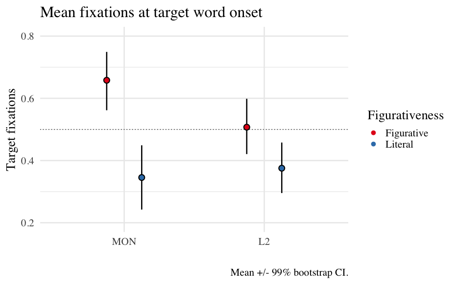

# Introduction

### .center[To be left high and dry   
The grass is always greener on the other side]

--

Even proficient L2 speakers have problems (Hill, 1999; Littlemore et al., 2011)   
- Inefficient processing (Kim & Nam, 2017)
- Use of different processing strategies (Littlemore & Low, 2006) 
- Storage?

???

Pollio et al.'s (1987)
English sources 3k novel metaphors + 7k idioms/week

---

# Introduction

## L1:  Constraint-Based Model (Libben & Titone, 2008)

--

## L2:  Literal Saliency Hypothesis (Cieślicka, 2006)

--

 
 
 

.center[Anticipation?]

???

CBM

Figurative language processed as literal language, but:
1. very familiar idioms are stored as units. 
2. the figurative interpretation of an idiom can be activated before the expression has reached its end.
3. the compositional and non-compositional meanings of the string may interact. 

LSH

- Conventionality
- Frequency
- Prototypicality
- Familiarity

(Huang, 2009)

SEMANTIC ANTICIPATION

- Gender (Huettig & Janse, 2016)
- Tense (Altmann & Kamide, 2007)
- Stereotypical constraints (Kamide, Altmann & Haywood, 2003)
- Nouns based on frequent context (DeLong, Urbach and Kutas, 2005; Nieuwland et al., 2017)

---

# My study

### Can L1 and L2 speakers of Spanish (proficient speakers and interpreters) predict figurative language based on the first lexical item of the expression?

--

 
.center[
Por _nada_ del __mundo__      
 (For (anything in) the world) 

]

---

# My study

## Prediction and Hypotheses

### L1 speakers 

Anticipate figurative expressions but not literal based on the first lexical element. 

### L2 speakers 

Cannot anticipate anything.         

--

  - Anticipation = multi-word unit      
  - No anticipation = individual words

???

&nbsp;&nbsp;&nbsp;&nbsp;&nbsp;&nbsp;

---

# Methods

## Participants

- 29 L1 Spanish
- 28 L1 English, advanced L2 Spanish
      
      
      
Comparable in working memory and phonological short-term memory.

???

Screening test: DELE
Homogeneized: WM & PSTM

---

# Methods

## Materials

9 collocations + 9 literal versions       
Frequency: CREA
 
 

### Example           

 

| Figurative | Literal |
|:---|:---|  
|  |   |    
| por nada del mundo  | por nada del plato |           
| (For the world) | (For anything on the plate) |

---

# Methods

## Procedure

### Norming Phase 
- Expression knowledge
- Familiarity      
(Molinaro & Carreiras, 2010; Cacciari & Corradini, 2015)

--

### Experimental Phase

- DELE
- Sociolinguistic background
- Eye-tracking task
- Phonological short-term memory task
- Collocation recognition tasks (2nd norming phase)

---

# Methods

### Eye-tracking sample trial

Audio: _La niña no se come por nada del mundo la colifor._   
(The little girl will not eat for anything in the world the cauliflower)

???

200 ms shift

<audio controls>
  <source src="./libs/FO1_C1.wav" type="audio/wav">
  <embed src="./libs/FO1_C1.wav" autostart="false" hidden="true" />
</audio>

---

# Statistical Analysis

### T-tests
### Generalized Linear Mixed Model

--

.pull-left[
FIXED EFFECTS
- Group
- Condition
- Frequency of occurrence   

RANDOM EFFECTS
- Participant
- Item
]

.pull-right[
DEPENDENT VARIABLE
- eLog count of fixations on target
]

---

# Results

Group anticipation comparison by figurativeness

???

50 ms bins

---

# Results

Condition anticipation comparison by group

--

**T-tests with Bonferroni correction**  
Mon*Fig target onset       
Fig vs lit for both groups

---

# Results

### GLMM

## Fixed effects:

**Main effects:**
- Condition (figurativeness)
- Frequency of occurrence

**Interaction effects:**
None

## Random effects:

Interaction of condition and frequency on slope
---

# Results

### GLMM Plot

---

# Discussion

- Only monolinguals were able to anticipate (?), albeit not at beginning of expression.

- Both groups fixated more on the correct target words in figurative trials than literal trials.

- Lexical cues did not work as such, unless figurative language takes longer to be processed (Boulenger et al., 2012; Kutas & Federmeier, 2000, 2011).

- More frequent expressions were slightly easier to anticipate

- Constraint-Based Model (Libben & Titone, 2008) supported (?)

- Literal Saliency Hypothesis (Cieślicka, 2006) not supported (?)

???

LSH:
L2 fixated more on figurative but not above chance, so they might not be so biased.
and L1 against (also learn literal words first and then figurative expressions)
L2 maybe connection between words but not stored as unit.

---

# Future directions

- Larger pool of expressions + other factors involved: Cross-linguistic effects, meaning transparency...

- Turning point between L1 and L2 speakers? -> Heritage speakers

- Anticipation practice helps? -> Interpreters

---

# Conclusion

- Lagging L2 figurative language performance may stem from storage.       

- Other factors need consideration for a full picture.

- Should we teach figurative expressions differently?

---

 
 
 
 
 
 

.center[
# Thank you
]

